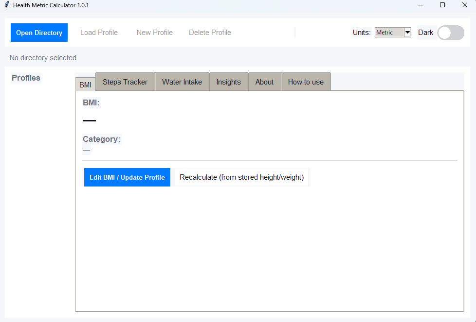
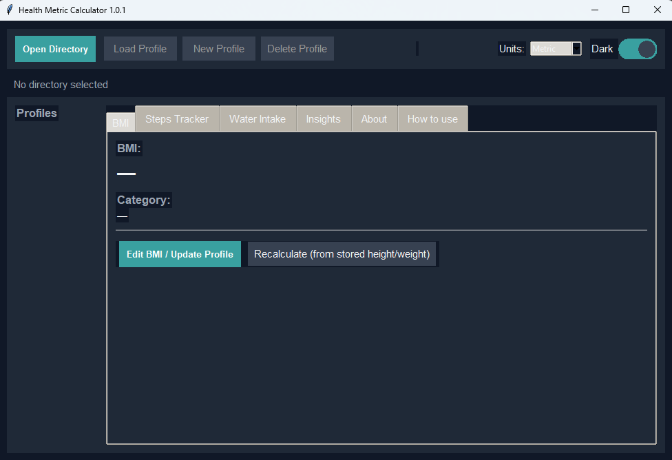

 Health Metric Calculator & Tracker


<br />

**A comprehensive, desktop-based health tracking application built with Python and Tkinter.** *Track BMI, daily steps, and water intake with persistent storage, interactive visualization, and a fully responsive Dark Mode.*

[Report Bug](https://github.com/BredWuzHere/Health-Metric-Calculator/issues) · [Request Feature](https://github.com/BredWuzHere/Health-Metric-Calculator/issues)

</div>

---

 Overview

The **Health Metric Calculator** is a robust desktop application designed to help users monitor their vital health statistics. Unlike simple calculators, this app features persistent user profiles, allowing you to track progress over time. 

It features a custom-built **Theme Engine** that interpolates colors for a smooth, animated transition between Light and Dark modes, ensuring the interface is comfortable to use at any time of day.

 Key Features

| Feature | Description |
| :--- | :--- |
|  **User Profiles** | Create, edit, and manage multiple user profiles with persistent storage using **SQLite**. |
|  **BMI Calculator** | Automatic calculation of BMI and Weight Status with support for **Metric** (kg/cm) and **Imperial** (lb/ft) units. |
|  **Theme Engine** | A custom-built, animated **Dark/Light mode toggle** that themes every element of the UI, including graphs and popups. |
|  **Daily Tracking** | Log your daily water intake (ml) and step counts via an intuitive calendar interface. |
|  **Visualization** | View your progress over time with dynamic line graphs generated via **Matplotlib**. |
|  **Smart Insights** | Get personalized health tips based on your BMI and tracking history stats. |

---

Interface

<div align="center">
  
  
</div>

---

 Technical Stack

* **Language:** Python 3.14
* **GUI Framework:** Tkinter (extensively using `ttk` for modern styling)
* **Database:** SQLite3 (Local file `profiles.db`)
* **Visualization:** Matplotlib
* **Algorithms:** Custom linear interpolation (Lerp) logic for smooth color transitions during theme toggling.

---

 Installation & Setup

Follow these steps to get the application running on your local machine.

 1. Clone the Repository
```bash
git clone [https://github.com/BredWuzHere/Health-Metric-Calculator.git](https://github.com/BredWuzHere/Health-Metric-Calculator.git)
cd health-metric-tracker
````

 2\. Install Dependencies

This application uses standard Python libraries (`tkinter`, `sqlite3`, `datetime`, `os`) but requires **Matplotlib** for the graphing features.

```bash
pip install matplotlib
```

 3\. Run the Application

```bash
python health_app.py
```

-----

 Usage Guide

1.  Select Directory: On first launch, click "Open Directory"** to choose where your database file (`profiles.db`) will be saved.
2.  Create Profile: Click New Profile", enter your name, height, and weight.
3.  Track Data: Navigate to the Steps or Water tabs. Click the calendar icon (📅) to select a date and input your data.
4.  Visualize: Click "Show Graph" on the respective tabs to see your historical trends.
5.  Toggle Theme: Use the toggle switch in the top right to switch between Light and Dark modes.

-----

 Release History

v1.0.0 - The "Dark Mode" Update (Current)

 Stable Release - November 25, 2025

This release focuses on UI consistency, visual polish, and fixing critical bugs regarding Dark Mode visibility.

    Dark Mode Text Fixes: Migrated inputs to standard `tk.Entry` to fix white-on-white text bugs.
    Themed Popups: Replaced system alerts with custom `Toplevel` windows that respect the active theme.
    Dark Mode Graphs: Implemented `matplotlib` styling contexts to dynamically colorize graphs (dark background, white axes).
    Bug Fixes: Resolved cursor visibility and padding issues.

 v0.8.0 - Beta Phase

  Feature Complete - November 24, 2025*

    Added: Dark Mode toggle with smooth animation logic.
    Added: Matplotlib integration for visualizing Steps and Water history.
    Added: "Insights" tab for text-based health advice.
    Added: Imperial Unit support (ft/in and lbs).

 v0.5.0 - Alpha

 Proof of Concept - November 23, 2025

Core: Basic Tkinter window and SQLite connection.
Math: Basic BMI calculation logic implemented.

-----

About

Project: CS121 Advanced Computer Programming  
Institution: Batangas State University (BSU)  
Developer: [Your Name/BredWuzHere]

License
This project is open source and available under the [MIT License](https://www.google.com/search?q=LICENSE).


